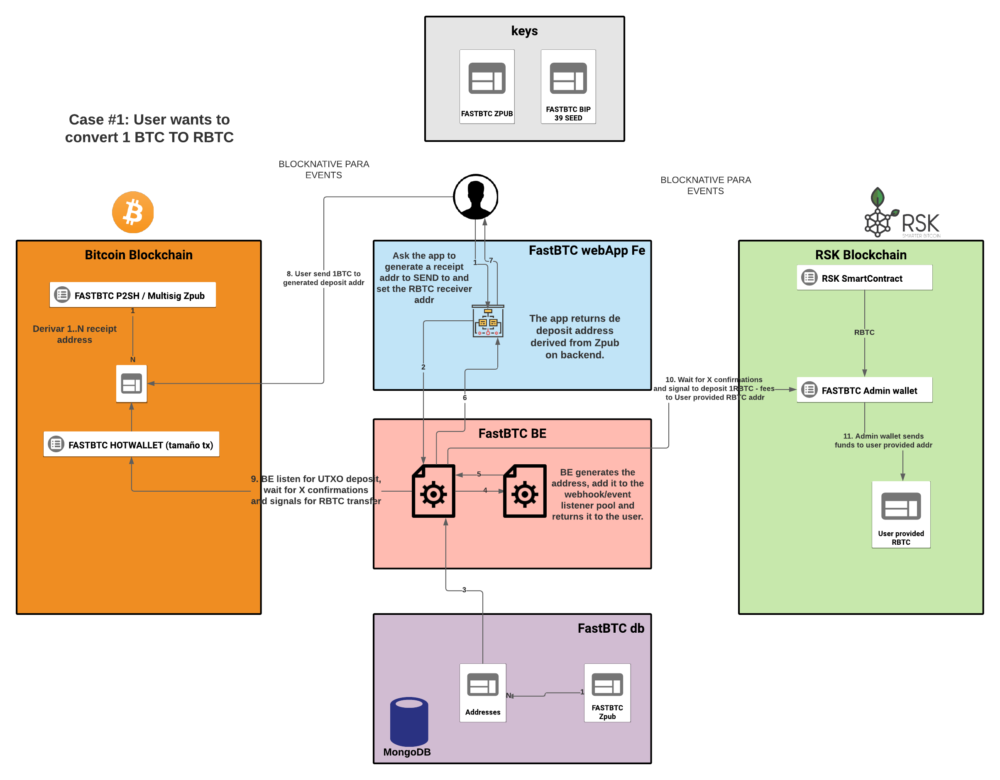

# fastbtc-rsk

## Index

* [API](/docs/API.md)
* [SETUP](/docs/SETUP.md)
* [ADMIN PANEL SETUP](/docs/ADMIN-SETUP.md)

### TODO

#### Done

* Better UX/UI per-side confirmation completion on tx N confirmations [x]
* On RBTC to BTC decide on wallet, tx construction and automatic relay depending on value being transfered [x]
* Functions to fetch Hot/MultiSig on BTC wallet and RSK contract balance. [x]@maxidev
* Create a new function to execute on setInterval that checks the balance on hot/multisig btc and RSK contract and alert if below threshold [x]maxidev
* Sanitize client side inputs and validate base58/ETH address type to avoid user entering wrong address type or garbage [x] @conrado/@maxidev/@agustin
* Check if Electrumx server can be use to get latest block on BTC [x] @maxidev
* On front end show an estimate time for conversion completion depending on the total order.value (given the routing order transaction depending on order.value) [x] @conrado/@agustin
* cleanUp() on process-status of pending orders and createdTime > 1h : mark as deleted /BTC_RTBTC -> unwatch [x] @maxidev
* On clear_order on front end -> cleanUp(orderId) / Review polling / bug shown on video that changes orders [x] @agustin
* Separate orders table app from client's order view | new endpoint to set txId on hot_wallet unsigned / multisig [x] @maxidev @agustin
* Endpoint to set txId when manually executed on RBTC_TO_BTC flow and save into proper order [x] @maxidev
* Add convesion rate btc<->rbtc taking operation_fee into account [x] @maxidev
* Enable function that check that the tx value sent to blocknative watchess address is >= to order value [x] @maxidev
* Add to package.json script to build production ready front end assets and serve from express [x] @maxidev/@agustin
* add watchdog to restart process-status if it hangs [x] @maxidev
* Fine grain RSK Contract consumption calculation [x] @sebastian
* Force toLowerCase() on RSK addresss [x]
* Create some step indicators for better user understanding [x]
* Tune block confirmations [x]
#### Pending

* Add qr code to show deposit addresses [] WIP
* Add telegram channel for support at the bottom of the app []

## Infrastructure overview

